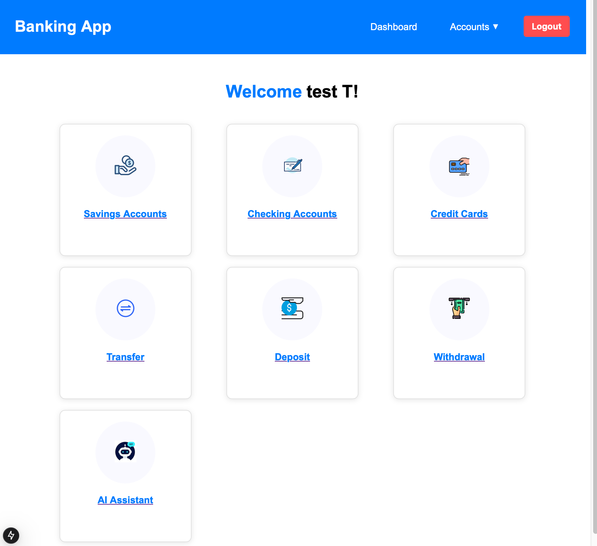

# AI powered Online Banking System
### Tech stack - Next.Js + Flask

## Setup steps

```bash
git clone git@github.com:NormieNoob/Banking_Management_system.git
```

* Setup the backend

```bash
cd backend
touch .env
pip install -r requirements.txt
```

* Type the following command to run the backend server

```bash
python app.py
```


* Open new terminal & type the following commands

```bash
cd ../frontend
touch .env
npm install
```

* Get the api key for gemini & paste it in the .env file


```
#frontend/.env
NEXT_PUBLIC_GEMINI_API_KEY=your_api_key
```

```bash
npn run dev
```

## Screenshots

* Home page -


* Signup - 


* Login -


* Dashboard -



* Balance & transaction history -


* Fund transfer -


* eposit -


* Withdraw -


* Ai Assistant -

